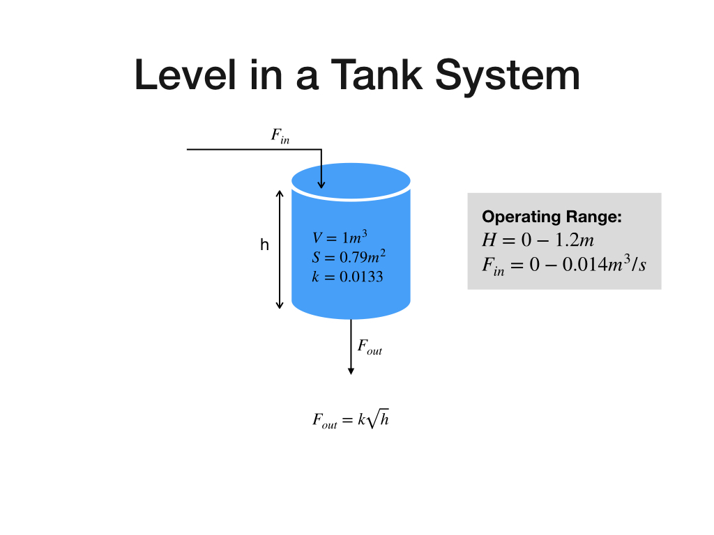

# Tank-Level-Control-with-Reinforcment-Learning

*This repository is still being updated for a batter navigation through the code. All the codes have been already uploaded.

This repository demonstrates the reinforcement learning TD Q-Learning algorithm to control the level of the tank

# System Information

The system, as shown in the figure, has one inlet and outlet. The outlet flow form the tank depends on the level of the liquid in the tank. 
